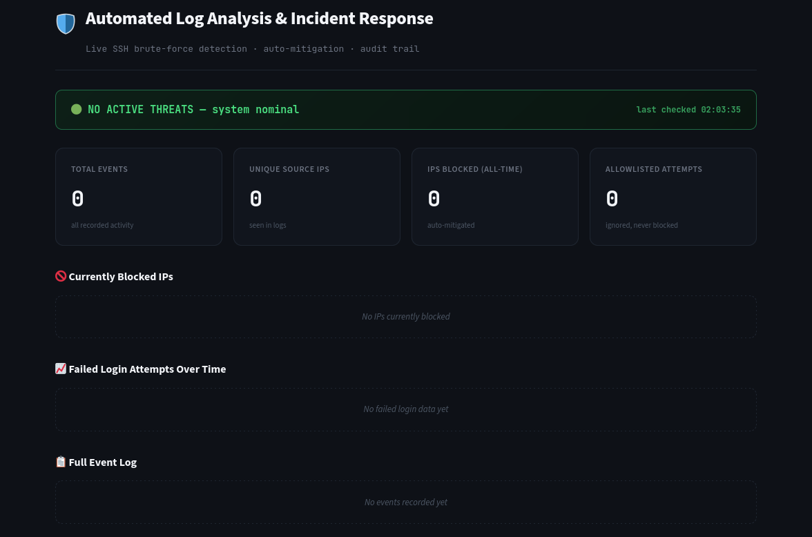
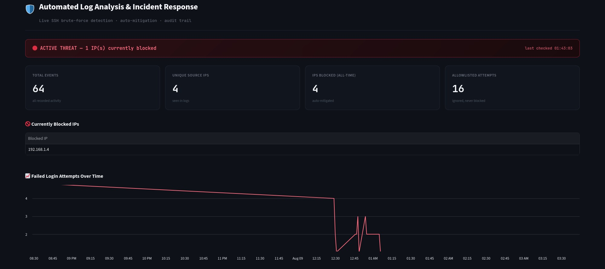
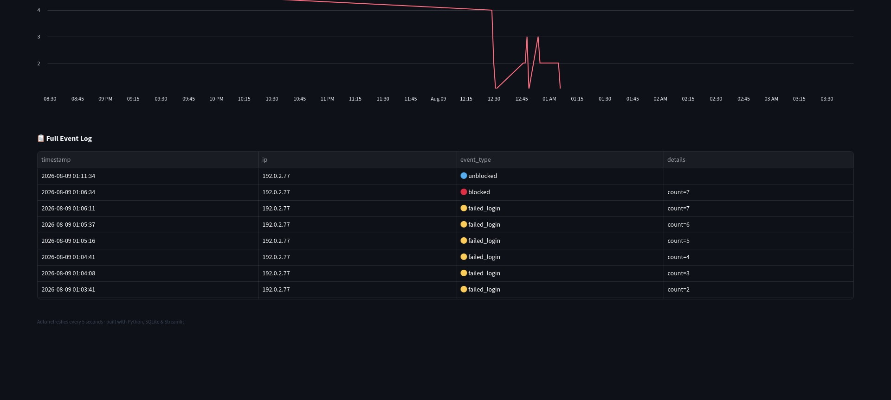

# 🛡️ Automated Log Analysis & Incident Response Tool

Automated SSH brute-force detection and response system — detects, blocks, and visualizes SSH brute-force attacks in real time using Python, SQLite, and Streamlit.

## Screenshots

**Dashboard Overview**

Live view of the system's overall state: total events processed, unique attacker IPs seen, total IPs blocked all-time, and allowlisted attempts (safe IPs that triggered detection logic but were never blocked). The red banner at the top gives an at-a-glance active/inactive threat status.

**Currently Blocked IPs**

A time-series view of failed login attempts, grouped by minute. This makes attack bursts visually obvious — a flat line means no activity, while spikes correspond to brute-force attempts being actively detected in the logs

**Attack Timeline**

Shows which IPs are actively blocked by `iptables` right now, pulled live from the event database by comparing `blocked` events against `unblocked` events. This table empties automatically once a block's 5-minute duration expires.

## What it does

This tool monitors SSH authentication logs on a Linux server in real time, detects brute-force login patterns using a sliding-window threshold algorithm, automatically blocks the attacking IP via `iptables`, logs every event to a SQLite database, and displays live results on a Streamlit dashboard.

Built as a hands-on lab project simulating a real attacker/defender scenario using two isolated VirtualBox VMs (Kali Linux as attacker, Ubuntu Server as victim).

## Architecture
Hydra (attacker) → SSH failed logins → auth.log

↓

detect.py (Python, regex + sliding window)

↓

Threshold exceeded? → iptables block + SQLite log

↓

dashboard.py (Streamlit, live visualization)
## How it works

1. **Detection** — `detect.py` tails `/var/log/auth.log` in real time, uses regex to extract failed-login IPs, and tracks failure counts per IP within a 60-second sliding window.
2. **Response** — once an IP exceeds 5 failures in 60 seconds, the script automatically adds an `iptables DROP` rule for that IP. Blocks auto-expire after 5 minutes.
3. **Safeguards** — an allowlist prevents trusted IPs (e.g. management/admin IPs) from ever being blocked, even under attack. Allowlisted attempts are still logged for audit purposes, just never blocked.
4. **Persistence** — every event (failed login, block, unblock, allowlisted attempt) is written to a SQLite database.
5. **Visualization** — `dashboard.py` reads from the database and displays live metrics, currently blocked IPs, an attack timeline, and full event history.

## Setup

1. Two VMs on an isolated VirtualBox NAT Network: Kali Linux (attacker) and Ubuntu Server (victim, with OpenSSH server)
2. On the victim: `sudo python3 detect.py` (requires root for iptables access)
3. On the victim: `streamlit run dashboard.py --server.address 0.0.0.0`
4. From the attacker: `hydra -l <user> -P <wordlist> ssh://<victim-ip>`
5. View the dashboard at `http://<victim-ip>:8501`

## Real bugs I found and fixed

- **Hydra `-p` vs `-P` flag**: used lowercase `-p` (single password) instead of uppercase `-P` (password file) — Hydra silently tried the literal string as a password instead of reading the wordlist. Case-sensitive flags can fail silently without erroring.
- **Missing `.append()` call**: detection counter stayed at 0 because I filtered a list before ever adding the new timestamp to it — the code ran without errors but produced silently wrong results, a good reminder that "no crash" doesn't mean "correct."
- **Missing `-s` flag in iptables command**: block/unblock functions initially omitted the `-s` (source) flag, so the firewall commands were malformed and failed silently in the background.

## Notable discovery: OpenSSH's built-in rate limiting

While testing, I observed OpenSSH's own `srclimit_penalise` mechanism activating independently of my tool — the OS itself was throttling repeated failed connections from the same source. This showed me that real environments already have layered defenses, and that my tool operates alongside existing OS-level protections rather than being the only line of defense.

## Limitations

- **Detection latency vs. concurrent attacks**: my defense reliably stops *sequential* brute-force attempts, blocking the IP before a correct password later in the attempt sequence can succeed. However, testing with Hydra's default parallel mode (multiple simultaneous connection attempts) showed that a correct password can complete before my threshold-based counter reacts, since detection is based on reading log lines one at a time. This reflects a real, known limitation of reactive log-based detection against concurrent attacks — the same reason production systems pair detection with proactive rate-limiting (like OpenSSH's own penalty system).
- **Single attack vector**: currently only detects SSH password brute-forcing via failed-login log patterns. Doesn't detect other attack types (e.g. slow/low-rate attacks, distributed multi-source attacks, or non-SSH services).
- **Local-scale only**: built and tested in a two-VM isolated lab, not tested at production log volume or against real-world noise/false-positive rates.
- **No persistent allowlist beyond IP**: allowlist is a simple hardcoded IP set; a production system would likely support CIDR ranges, dynamic updates, and role-based exceptions.

## What I'd add with more time

- A second attack pattern (e.g. slow/low-and-slow brute force) to test adaptive detection
- A human-in-the-loop review panel in the dashboard for manually approving/reversing blocks
- False-positive/false-negative rate analysis with real test data
- CIDR-range and dynamic allowlist support

## Tech stack

Python · SQLite · Streamlit · iptables · Hydra · VirtualBox · Kali Linux · Ubuntu Server

## Disclaimer

Built entirely in an isolated local lab environment for educational purposes. Some dashboard screenshots include seeded demo data (clearly generated via `seed_demo_data.py`) for illustration purposes alongside real test results.
